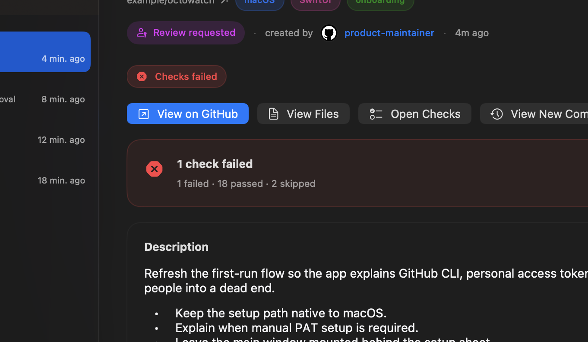
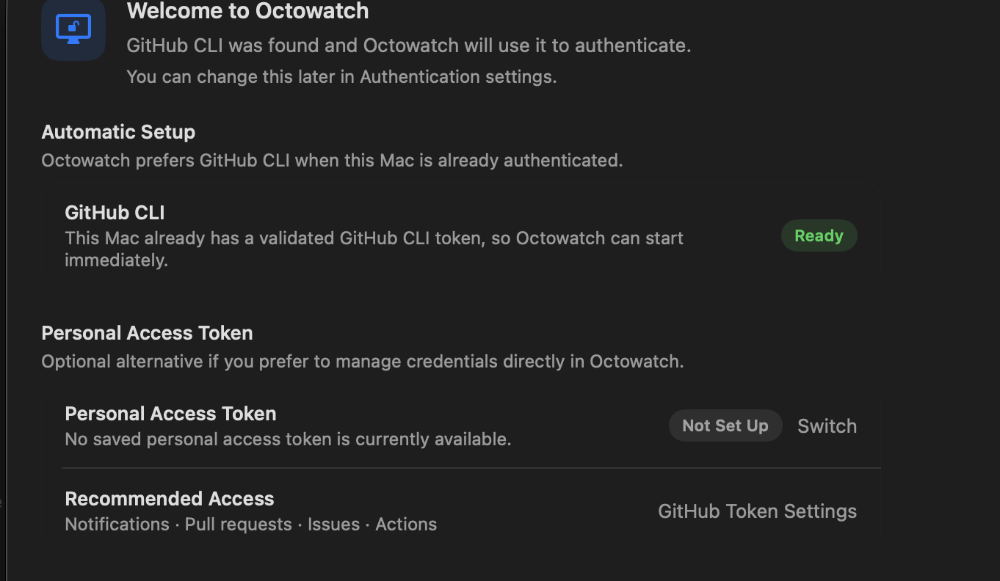

<p align="center">
  
</p>

# Octowatch

Octowatch is a native macOS app that watches GitHub and pulls the work
that needs your attention into one place.

It lives in the menu bar, opens into a full triage window when you need
more context, and focuses on actionable pull requests, notifications,
workflow runs, and security alerts without requiring a GitHub App or
webhooks.

## Screenshots





## What It Does

- Builds a single inbox from pull requests, issues, workflows, and
  GitHub notifications
- Highlights a `Your Turn` section with configurable rules for what
  needs action now
- Shows rich pull request detail with checks, review threads, timeline,
  merge state, and direct actions
- Tracks workflow failures and approval-gated deployments connected to
  your pull requests
- Surfaces GitHub security alerts without collapsing them into generic
  comment notifications
- Supports local read state, snoozing, ignoring, undo, and a menu bar
  quick-view for fast triage

## Authentication

Octowatch prefers GitHub CLI when it is available:

- if `gh` is installed and authenticated, Octowatch reuses
  `gh auth token`
- if you do not want to use GitHub CLI, you can enter a personal access
  token in Settings
- manually entered tokens can stay session-only or be saved in Keychain

On first launch, Octowatch always shows a setup guide so the auth path
is explicit. If GitHub CLI is already ready, the guide tells you that
Octowatch will use it and still offers a direct path to switch to a
personal access token.

Because Octowatch reads GitHub notifications, the token must work with
the Notifications API. In practice, that usually means:

- classic personal access tokens work
- fine-grained personal access tokens are often not enough for the
  notifications endpoints Octowatch depends on

## Requirements

- macOS 26 or newer
- Swift 6.2+
- XcodeGen for local Xcode project generation

## Getting Started

GitHub Actions now validates SwiftPM tests, Xcode unit tests, and the
unsigned macOS release-packaging path in CI. Signing and notarization
are still not wired in yet, so the supported runtime path is still to
run Octowatch from source:

```bash
git clone <repo-url>
cd octowatch
swift build
swift run
```

If you want to work in Xcode:

```bash
xcodegen generate
open Octowatch.xcodeproj
```

The generated `.xcodeproj` is local-only and is not committed.

## Website And Releases

- The project website sources live in [`website/`](website/).
- GitHub Pages deployment is defined in
  [`.github/workflows/pages.yml`](.github/workflows/pages.yml).
- CI validation is defined in [`.github/workflows/ci.yml`](.github/workflows/ci.yml).
- Unsigned release packaging is defined in
  [`.github/workflows/release.yml`](.github/workflows/release.yml).
- Release operation notes live in [docs/RELEASING.md](docs/RELEASING.md).

## Product Notes

- Polling only. No GitHub App, webhooks, or background service
  required.
- Default refresh interval is 60 seconds.
- GitHub notification threads are fetched from both read and unread
  feeds, while the inbox read/unread state remains local to Octowatch.
- If the app starts while offline, it shows a dedicated recovery state
  and retries automatically when connectivity returns.

## Roadmap

The current shipped scope and remaining gaps live in
[PRD.md](PRD.md).

The main items still open are:

- richer issue detail
- mark-section-read / mark-all-read actions
- deeper keyboard navigation
- stale PR indicators
- deep-link support

## Contributing

See [CONTRIBUTING.md](CONTRIBUTING.md).

## Security

See [SECURITY.md](SECURITY.md).

## License

[MIT](LICENSE)
